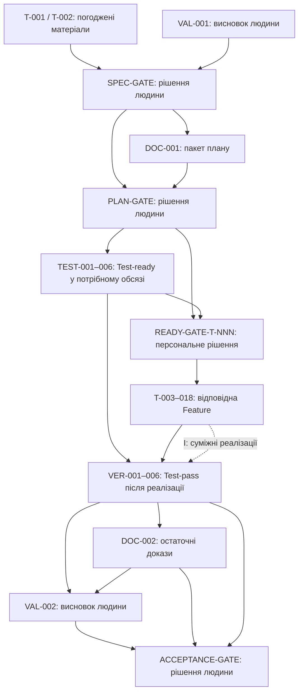

# Залежності між тікетами

Дата: 7 жовтня 2026 року. **Статус: пропозиція для перевірки людиною, не затверджено.** Джерело: [скоригована декомпозиція](revised-decomposition.md); вимоги й критерії — [SRS](../spec/srs.md), [AC](../spec/acceptance-criteria.md), [BDD](../spec/bdd-scenarios.md). Усі Gate очікують рішення людини; жодного GO тут не зафіксовано.

Документ уточнює організацію робіт, зберігає функціональні групи та REQ. Він не змінює попередні плани або специфікацію, не створює GitHub Issues і не дозволяє почати реалізацію.

## Правила залежностей

- **B — до початку:** результат передумови готовий; якщо це Gate, потрібне явне рішення людини **GO** для чинної версії та потрібного обсягу. Закриття Issue, позначка checklist або відсутність відповіді не дорівнює GO.
- **C — до завершення:** роботу можна почати за її B-умовами, але закінчити лише після зазначених результатів. Ці зв’язки теж враховані в перевірці графа на цикли.
- **I — інтеграція:** зв’язок не блокує початок Feature. Наявність обох реалізацій потрібна для відповідного інтеграційного випадку; завершення Verification вимагає всіх таких випадків.
- Залежність від T-001/T-002 означає готовність релевантного, погодженого людиною результату, а не обов’язково закриття всього пакетного тікета. Відкладені питання залишаються відкритими. Якщо вони змінюють очікування тесту, відповідна частина Test та Feature заблокована.
- Проєктування Feature й підготовка матеріалів її рішення можуть початися після PLAN-GATE GO та потрібних уточнень, без GO її READY-GATE. **Код реалізації починається лише після READY-GATE-T-NNN GO.** Gate не готує проєктування, код, тести або тестові дані: він тільки фіксує рішення людини щодо вже підготовлених матеріалів.

## Готовність Test і проходження після реалізації

**Test-ready до Feature:** для конкретного обсягу готові випадки REQ/AC/BDD, очікувані результати, фікстури, заготовки/скрипти та порядок запуску, включно з граничними й негативними випадками. Готовність може бути зафіксована окремо для кожної Feature всередині пакетного TEST-тікета. Успішні продуктові тести до реалізації не вимагаються. Імітації суміжних функцій дозволяють підготувати перевірки без зворотної залежності Test від Feature.

**Test-pass після Feature:** результати запусків на реалізації, виправлення невідповідностей та інтеграційні докази фіксуються у VER-001–VER-006. Локальні запуски в Feature не підміняють Verification. Завершення Feature-передумови означає готовність її реалізації та локальні перевірки згідно з попереднім планом, а не завершення всього її VER-пакета: інакше інтеграційні зв’язки могли б створити цикли.

Якщо REQ Feature пов’язаний з кількома TEST-пакетами у таблиці покриття попереднього плану, до її реалізації готові релевантні частини **всіх** цих пакетів. Закриття одного спільного TEST-тікета не дає дозволу на решту Feature без їх персонального GO.

## Specification, Addendum, Validation і Documentation

| ID / тип | Блокувальні залежності | Коли можна починати |
| --- | --- | --- |
| T-001 / Specification | B: немає. C: відповіді людини на Q-01–Q-10 для завершення всього пакета. | Можна готувати питання й варіанти за джерелами; конкретне уточнення завершене лише після рішення людини. |
| T-002 / Addendum | B: погоджені релевантні результати T-001, якщо визначають очікування. C: погодження людиною запропонованих доповнень. | Незалежні пропозиції SR-011–SR-015 можна готувати одразу; залежні — після потрібного уточнення. |
| VAL-001 / Validation | B: немає. C: розглянуті релевантні результати T-001 та висновок людини про задум і відкриті питання. | Людина може розпочати зіставлення задуму/SKED/SRS; агент лише готує матеріали. VAL-001 не блокує початок T-001. |
| DOC-001 / Documentation | B: SPEC-GATE GO. | Готувати пакет плану для PLAN-GATE після GO щодо бази специфікації та дозволеного обсягу. |
| DOC-002 / Documentation | B: готова відповідна Feature для її розділу. C: VER-001–VER-006 завершені. | Чернетки — після потрібних Feature; фінальний документ — після доказів усіх VER. |
| VAL-002 / Validation | B: завершені VER-001–VER-006, DOC-002 та висновок VAL-001. | Людина починає валідацію реалізованого результату за перевіреною системою й документацією. |

## Gate: передумови розгляду рішення

У таблицях Gate умова початку означає **початок розгляду людиною**, а не початок виготовлення артефактів. Результат — GO, NO-GO або відкладене рішення з автором, датою, версією та обсягом. Лише GO дозволяє залежний перехід; усі наведені нижче Gate зараз **очікують рішення людини**.

| ID | Блокувальні залежності | Коли людина може розглянути рішення |
| --- | --- | --- |
| SPEC-GATE | B: матеріали T-001, погоджений релевантний результат T-002, висновок VAL-001. | Є визначена база специфікації, рішення/відкладені Q та межі дозволеного обсягу. |
| PLAN-GATE | B: SPEC-GATE GO, готовий DOC-001. | План, покриття, залежності, Test-пакети та відкриті питання готові до перевірки. |
| READY-GATE | Не є єдиним дозволом на реалізацію. Це індекс персональних рішень READY-GATE-T-003–READY-GATE-T-018. | Після PLAN-GATE GO можна вести індекс. Для кожного дочірнього рішення діють власні передумови нижче; закриття індексу нічого не дозволяє. |
| ACCEPTANCE-GATE | B: завершені VER-001–VER-006, DOC-002, VAL-002. | Людина має докази відповідності, документацію та висновок валідації для остаточного прийняття або доопрацювання. |

## Test: підготовка до реалізації

Для кожного пакета B: **PLAN-GATE GO**, релевантні погоджені результати T-001 та T-002. Немає залежності від реалізації Feature чи успішного проходження продуктових тестів. Перелічені Q застосовуються тільки до відповідної частини пакета.

| ID | Feature, для яких готується основний пакет | Уточнення, що блокують відповідну частину | Коли можна починати |
| --- | --- | --- | --- |
| TEST-001 | T-004, T-005, T-006, T-014 | Q-09 (лише частина T-004); застосовні доповнення T-002 | Після PLAN-GATE GO і погодження очікувань для обраної частини; підготовка інших незалежних частин не чекає реалізації. |
| TEST-002 | T-003, T-007 | Q-02/Q-03 (T-003), Q-07 (T-007); застосовні доповнення T-002 | Після PLAN-GATE GO і погодження очікувань для обраної частини; підготовка інших незалежних частин не чекає реалізації. |
| TEST-003 | T-008, T-009 | Q-04/Q-07 (T-008); успадковані правила для T-009; застосовні доповнення T-002 | Після PLAN-GATE GO і погодження очікувань для обраної частини; підготовка інших незалежних частин не чекає реалізації. |
| TEST-004 | T-010, T-011 | релевантні календарні правила з T-007; окремих Q немає; застосовні доповнення T-002 | Після PLAN-GATE GO і погодження очікувань для обраної частини; підготовка інших незалежних частин не чекає реалізації. |
| TEST-005 | T-012, T-013 | Q-02/Q-04/Q-05 (T-012), Q-06 (T-013); застосовні доповнення T-002 | Після PLAN-GATE GO і погодження очікувань для обраної частини; підготовка інших незалежних частин не чекає реалізації. |
| TEST-006 | T-015, T-016, T-017, T-018 | Q-08 (T-016), Q-10 (T-017); T-015/T-018 не блокуються цими питаннями; застосовні доповнення T-002 | Після PLAN-GATE GO і погодження очікувань для обраної частини; підготовка інших незалежних частин не чекає реалізації. |

## Персональні READY-GATE та Feature

Для **кожного** рядка Feature спільні B до реалізації: **SPEC-GATE GO → PLAN-GATE GO**, Test-ready усіх перелічених пакетів у її обсязі, погоджені застосовні уточнення T-001/доповнення T-002, готове проєктування та **GO лише її READY-GATE-T-NNN**. SPEC-GATE і PLAN-GATE мають охоплювати цю Feature. NO-GO, відкладене, відкликане або неактуальне рішення не дозволяє початок.

Для кожного персонального Gate B до розгляду: SPEC-GATE GO, PLAN-GATE GO, зазначені Test-ready, потрібні Q/доповнення, готове проєктування і перелічені Feature-передумови. **Залежності від самої цільової Feature немає.** Gate тільки фіксує рішення людини. У таблиці окремо показано всі 16 персональних Gate і всі 16 Feature; кожен Gate має статус «очікує рішення людини».

| ID Feature | ID персонального Gate | Test-ready до реалізації | Додаткові B: готові Feature | Прямі Q з T-001 | Умова початку реалізації |
| --- | --- | --- | --- | --- | --- |
| T-003 | READY-GATE-T-003 | TEST-002 | — | Q-02, Q-03 | Спільні B виконані, людина записала GO саме READY-GATE-T-003 для цієї версії та обсягу. |
| T-004 | READY-GATE-T-004 | TEST-001 | — | Q-09 | Спільні B виконані, людина записала GO саме READY-GATE-T-004 для цієї версії та обсягу. |
| T-005 | READY-GATE-T-005 | TEST-001 | T-004 | —; застосовні уточнення за REQ | Спільні B виконані, людина записала GO саме READY-GATE-T-005 для цієї версії та обсягу. |
| T-006 | READY-GATE-T-006 | TEST-001 | T-004 | —; застосовні уточнення за REQ | Спільні B виконані, людина записала GO саме READY-GATE-T-006 для цієї версії та обсягу. |
| T-007 | READY-GATE-T-007 | TEST-002 | — | Q-07 | Спільні B виконані, людина записала GO саме READY-GATE-T-007 для цієї версії та обсягу. |
| T-008 | READY-GATE-T-008 | TEST-003 | T-007 | Q-04, Q-07 | Спільні B виконані, людина записала GO саме READY-GATE-T-008 для цієї версії та обсягу. |
| T-009 | READY-GATE-T-009 | TEST-001, TEST-003 | T-003, T-004, T-007, T-008, T-014 | —; застосовні уточнення за REQ | Спільні B виконані, людина записала GO саме READY-GATE-T-009 для цієї версії та обсягу. |
| T-010 | READY-GATE-T-010 | TEST-004 | T-009 | —; застосовні уточнення за REQ | Спільні B виконані, людина записала GO саме READY-GATE-T-010 для цієї версії та обсягу. |
| T-011 | READY-GATE-T-011 | TEST-001, TEST-004 | T-007, T-009, T-010, T-014 | —; застосовні уточнення за REQ | Спільні B виконані, людина записала GO саме READY-GATE-T-011 для цієї версії та обсягу. |
| T-012 | READY-GATE-T-012 | TEST-005 | T-014 | Q-02, Q-04, Q-05 | Спільні B виконані, людина записала GO саме READY-GATE-T-012 для цієї версії та обсягу. |
| T-013 | READY-GATE-T-013 | TEST-001, TEST-005 | T-014 | Q-06 | Спільні B виконані, людина записала GO саме READY-GATE-T-013 для цієї версії та обсягу. |
| T-014 | READY-GATE-T-014 | TEST-001, TEST-003, TEST-004, TEST-005 | — | —; застосовні уточнення за REQ | Спільні B виконані, людина записала GO саме READY-GATE-T-014 для цієї версії та обсягу. |
| T-015 | READY-GATE-T-015 | TEST-006 | — | —; застосовні уточнення за REQ | Спільні B виконані, людина записала GO саме READY-GATE-T-015 для цієї версії та обсягу. |
| T-016 | READY-GATE-T-016 | TEST-006 | — | Q-08 | Спільні B виконані, людина записала GO саме READY-GATE-T-016 для цієї версії та обсягу. |
| T-017 | READY-GATE-T-017 | TEST-006 | — | Q-10 | Спільні B виконані, людина записала GO саме READY-GATE-T-017 для цієї версії та обсягу. |
| T-018 | READY-GATE-T-018 | TEST-006 | — | —; застосовні уточнення за REQ | Спільні B виконані, людина записала GO саме READY-GATE-T-018 для цієї версії та обсягу. |

Q Feature-передумов успадковуються через їх готові результати. T-014 може створити спільні правила доступу до завершення всіх операцій; повнота їх застосування перевіряється після інтеграції. T-009 не чекає завершення T-013 для початку: конкурентна службова операція перевіряється після обох реалізацій.

## Інтеграційні зв’язки I, що не блокують Feature

Таблиця переносить інтеграційні зв’язки попередньої версії. Якщо той самий тікет є і B у попередній таблиці, і I тут, готовність його базового результату лишається B; додатковий спільний сценарій є I. Наприклад, T-007 потрібний як базові календарні правила до T-009, а поведінка повного створення перевіряється разом.

| Feature | Партнери I | Де фіксуються результати |
| --- | --- | --- |
| T-003 | T-007, T-009, T-010, T-012, T-013 | VER-002 та релевантні VER партнерів; спільний доказ можна посилати з обох звітів. |
| T-004 | T-005, T-014 | VER-001 та релевантні VER партнерів; спільний доказ можна посилати з обох звітів. |
| T-005 | T-014 | VER-001 та релевантні VER партнерів; спільний доказ можна посилати з обох звітів. |
| T-006 | T-009, T-010, T-014 | VER-001 та релевантні VER партнерів; спільний доказ можна посилати з обох звітів. |
| T-007 | T-009 | VER-002 та релевантні VER партнерів; спільний доказ можна посилати з обох звітів. |
| T-008 | T-009, T-012 | VER-003 та релевантні VER партнерів; спільний доказ можна посилати з обох звітів. |
| T-009 | T-010, T-012, T-013 | VER-003 та релевантні VER партнерів; спільний доказ можна посилати з обох звітів. |
| T-010 | T-006, T-011, T-014 | VER-004 та релевантні VER партнерів; спільний доказ можна посилати з обох звітів. |
| T-011 | T-003, T-013 | VER-004 та релевантні VER партнерів; спільний доказ можна посилати з обох звітів. |
| T-012 | T-003, T-008, T-009, T-013 | VER-005 та релевантні VER партнерів; спільний доказ можна посилати з обох звітів. |
| T-013 | T-003, T-009, T-010, T-012 | VER-005 та релевантні VER партнерів; спільний доказ можна посилати з обох звітів. |
| T-014 | T-003, T-004, T-005, T-006, T-007, T-008, T-009, T-010, T-011, T-012, T-013 | VER-001 та релевантні VER партнерів; спільний доказ можна посилати з обох звітів. |
| T-015 | T-003, T-004, T-005, T-006, T-007, T-008, T-009, T-010, T-011, T-012, T-013, T-014 | VER-006 та релевантні VER партнерів; спільний доказ можна посилати з обох звітів. |
| T-016 | T-004, T-005, T-006, T-007, T-008, T-009, T-010, T-011, T-012, T-013, T-014 | VER-006 та релевантні VER партнерів; спільний доказ можна посилати з обох звітів. |
| T-017 | T-003, T-009, T-010, T-011, T-018 | VER-006 та релевантні VER партнерів; спільний доказ можна посилати з обох звітів. |
| T-018 | T-003, T-004, T-005, T-006, T-007, T-008, T-009, T-010, T-011, T-012, T-013, T-014 | VER-006 та релевантні VER партнерів; спільний доказ можна посилати з обох звітів. |

## Verification: після реалізації

B до початку пакетної Verification — готові зазначені основні Feature й TEST-пакет. Релевантні додаткові TEST-пакети з таблиці Feature також використовуються. Окремі локальні випадки можна запускати в межах Feature раніше, але це не завершення VER. I у цій таблиці стають **C до завершення VER**, не B до початку Feature; результати інших VER не є передумовою запуску цього VER.

| ID | B до початку | I / C до завершення | Коли можна починати |
| --- | --- | --- | --- |
| VER-001 | TEST-001 Test-ready; T-004, T-005, T-006, T-014 реалізовані | T-003, T-007, T-008, T-009, T-010, T-011, T-012, T-013; усі релевантні інтеграційні тести пройшли | Після готовності B; завершити після позитивних доказів AC/BDD, потрібної інтеграції та повторної перевірки виправлень. |
| VER-002 | TEST-002 Test-ready; T-003, T-007 реалізовані | T-009, T-010, T-012, T-013; усі релевантні інтеграційні тести пройшли | Після готовності B; завершити після позитивних доказів AC/BDD, потрібної інтеграції та повторної перевірки виправлень. |
| VER-003 | TEST-003 Test-ready; T-008, T-009 реалізовані | T-010, T-012, T-013; усі релевантні інтеграційні тести пройшли | Після готовності B; завершити після позитивних доказів AC/BDD, потрібної інтеграції та повторної перевірки виправлень. |
| VER-004 | TEST-004 Test-ready; T-010, T-011 реалізовані | T-003, T-006, T-013, T-014; усі релевантні інтеграційні тести пройшли | Після готовності B; завершити після позитивних доказів AC/BDD, потрібної інтеграції та повторної перевірки виправлень. |
| VER-005 | TEST-005 Test-ready; T-012, T-013 реалізовані | T-003, T-008, T-009, T-010; усі релевантні інтеграційні тести пройшли | Після готовності B; завершити після позитивних доказів AC/BDD, потрібної інтеграції та повторної перевірки виправлень. |
| VER-006 | TEST-006 Test-ready; T-015, T-016, T-017, T-018 реалізовані | T-003, T-004, T-005, T-006, T-007, T-008, T-009, T-010, T-011, T-012, T-013, T-014; усі релевантні інтеграційні тести пройшли | Після готовності B; завершити після позитивних доказів AC/BDD, потрібної інтеграції та повторної перевірки виправлень. |

## Запропоноване подання у GitHub Issues

Це схема майбутнього ручного створення Issues, а не виконана операція. Локальні ID не є GitHub-номерами.

1. Для SPEC-GATE, PLAN-GATE та ACCEPTANCE-GATE — окремі Issues з міткою `Gate` і відповідними передумовами.
2. Для READY-GATE — індексний Issue `[READY-GATE] Реєстр готовності Feature` з посиланнями на **16 окремих Issues**: `[READY-GATE-T-003] GO/NO-GO для T-003`, …, `[READY-GATE-T-018] GO/NO-GO для T-018`. Кожен має мітку `Gate`, одну цільову Feature та її власні передумови. Індекс не містить загального GO й не є блокером, закриття якого розблоковує реалізацію.
3. У кожному Feature Issue вказати ID/майбутні посилання SPEC-GATE, PLAN-GATE, **конкретного** READY-GATE-T-NNN, потрібних TEST-пакетів і Feature-передумов. Інтеграційні партнери й VER-пакети зазначаються окремо від блокерів.
4. У кожному TEST Issue вести готовність частин окремо: `Test-ready для T-NNN`, посилання на випадки/фікстури/методику, версію й невирішені питання. Checkbox показує готовність матеріалів, а не дозвіл на Feature і не результат проходження.
5. Персональний Gate Issue містить посилання на вже підготовлені матеріали; рішення залишає уповноважена людина. Порожній Issue, його закриття агентом або закриття без явного GO не дає дозволу. Рішення NO-GO чи відкладення також не дає дозволу, навіть якщо Issue закритий.

Шаблон **незаповненого** рішення в окремому Gate Issue:

```text
Gate ID: READY-GATE-T-NNN
Target Feature: T-NNN / <посилання на Feature Issue>
State: очікує рішення людини
Decision: <людина обирає GO / NO-GO / відкласти>
Decision author: <людина>
Decision date: <дата>
Specification / plan revision: <commit або версія>
Allowed scope: <REQ, AC та конкретний обсяг цієї Feature>
Test-ready evidence: <посилання для кожного потрібного пакета>
Design evidence: <посилання на матеріали проєктування Feature>
Prerequisite evidence: <GO попередніх Gate, готові Feature, рішення Q>
Restrictions / open questions: <перелік>
Human decision comment: <посилання на явне рішення>
```

Матеріали створюються у Specification/Addendum/Test/Feature-підготовці/Documentation, а не в Gate. Gate тільки фіксує рішення й посилання на докази. Якщо змінено базу вимог, тести, проєктування чи дозволений обсяг так, що попередній GO більше не застосовний, людина повторно розглядає **лише потрібний персональний Gate**; старий запис зберігається в історії. GO для T-003 не переноситься на T-004 або решту Feature.

## Компактна діаграма основних залежностей

Суцільні стрілки — блокувальні переходи (B або C); пунктир — інтеграційний зв’язок I. Вузли Test/Feature/Verification агреговані для компактності; персональний READY-GATE обов’язковий для кожної Feature, усі додаткові B наведені в таблицях. Діаграма не показує, що будь-який перехід уже дозволено.



## Перевірка циклів та уточнення

Для перевірки використано всі блокувальні ребра B та C з таблиць, включно з усіма 16 персональними READY-GATE. Погоджені результати пакетних T-001/T-002 і Test-ready моделюються як передумови, готовність яких не залежить від Feature; проєктування передує персональному Gate. READY-GATE-індекс не має ребер дозволу до Feature. Інтеграційні I не додаються як залежності початку Feature, але необхідні реалізації включені як C для відповідних VER.

**Результат перевірки: циклів немає** у графі 54 вузлів (38 ID попереднього плану та 16 конкретних персональних рішень). Перевірено топологічним сортуванням графа B/C; умовні залежності враховано консервативно, тому їх звуження до погодженого обсягу не додає циклів.

Один допустимий порядок для перевірки структури (не розклад і не дозвіл починати):

`T-001 → T-002 → VAL-001 → SPEC-GATE → DOC-001 → PLAN-GATE → READY-GATE → TEST-001 → TEST-002 → TEST-003 → TEST-004 → TEST-005 → TEST-006 → READY-GATE-T-003 → READY-GATE-T-004 → READY-GATE-T-007 → READY-GATE-T-014 → READY-GATE-T-015 → READY-GATE-T-016 → READY-GATE-T-017 → READY-GATE-T-018 → T-003 → T-004 → T-007 → T-014 → T-015 → T-016 → T-017 → T-018 → READY-GATE-T-005 → READY-GATE-T-006 → READY-GATE-T-008 → READY-GATE-T-012 → READY-GATE-T-013 → T-005 → T-006 → T-008 → T-012 → T-013 → READY-GATE-T-009 → T-009 → READY-GATE-T-010 → T-010 → READY-GATE-T-011 → VER-002 → VER-003 → VER-005 → T-011 → VER-001 → VER-004 → VER-006 → DOC-002 → VAL-002 → ACCEPTANCE-GATE`

Порівняно з попереднім планом уточнено:

- READY-GATE розгорнуто в 16 персональних рішень; індекс не розблоковує Feature.
- Для Feature показано не лише основний, а й додаткові Test-пакети, якщо їх вимагає покриття спільних REQ. Пакетна готовність застосовується до конкретного обсягу.
- Розділено підготовку/проєктування та початок реалізації, Test-ready до реалізації й Test-pass у Verification після неї.
- Відокремлено блокери початку B, блокери завершення C та інтеграційні I; чернетки DOC-002 й часткові матеріали можуть готуватися раніше фінальних доказів.
- Gate тільки фіксує рішення людини, а не виробляє код, тести чи проєктування. Жоден Gate не позначено пройденим, жодні Issues не створено.
